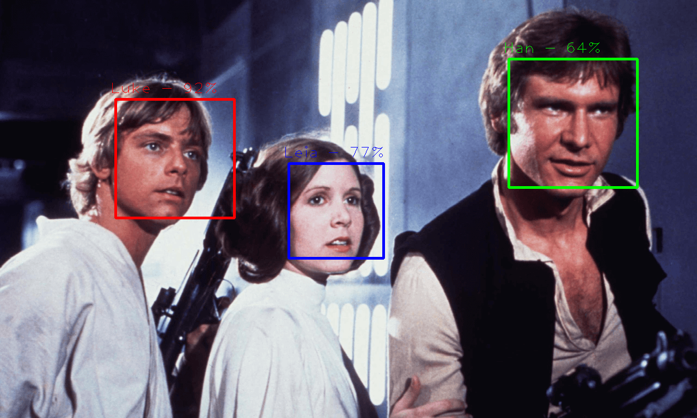

<<<<<<< HEAD
# Face detection and recognition in Python using OpenCV

This is the code used in this [tutorial](https://noahingham.com/blog/facerec-python.html) from 2014.

Tested in Python 2.7 and 3.6 using OpenCV3.2.
=======
# face-recognition-python
Repo that contains code with face recognition, pipelining etc for webcam
>>>>>>> 60e4ad7c9f13703dfda88ba6eadfaa18689c96b1
